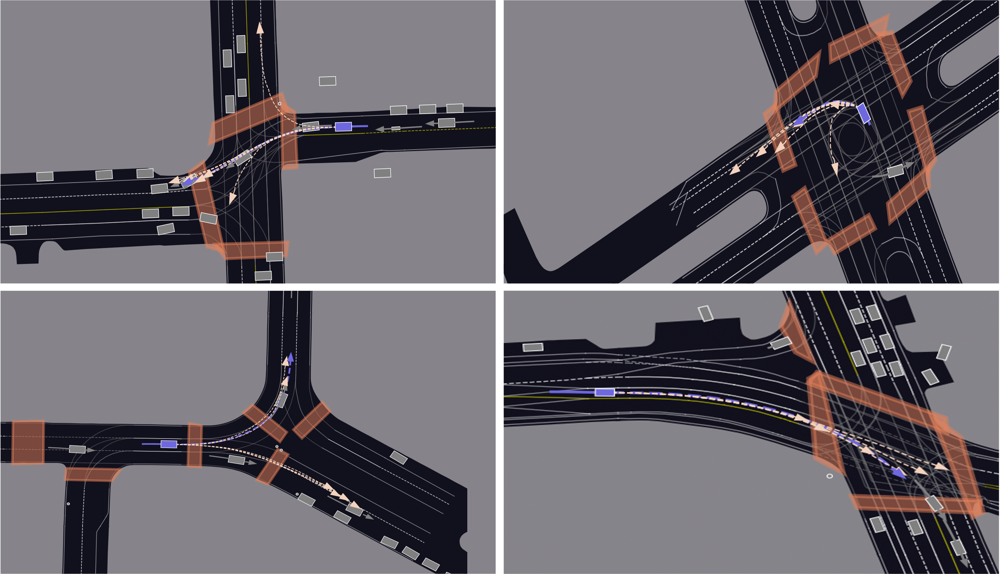

# QCNet: An Elegant, Performant, And Scalable Framework For Marginal/Joint Multi-Agent Trajectory Prediction

[Paper](https://openaccess.thecvf.com/content/CVPR2023/papers/Zhou_Query-Centric_Trajectory_Prediction_CVPR_2023_paper.pdf) | [Technical Report](https://arxiv.org/abs/2306.10508) | [YouTube](https://www.youtube.com/watch?v=i46Sj0PUwyI) | [Twitter](https://twitter.com/zkktg00/status/1670978536059076608?s=20) | [微信公众号](https://mp.weixin.qq.com/s/Aek1ThqbrKWCSMHG6Xr9eA) | [經濟日報](https://money.udn.com/money/story/5612/7184617?from=edn_search_result)

This repository is the official implementation of the [CVPR 2023](https://cvpr2023.thecvf.com/) paper: [Query-Centric Trajectory Prediction](https://openaccess.thecvf.com/content/CVPR2023/papers/Zhou_Query-Centric_Trajectory_Prediction_CVPR_2023_paper.pdf).

**Authors**: [Zikang Zhou](https://zikangzhou.github.io/), [Jianping Wang](https://scholars.cityu.edu.hk/en/persons/jianping-wang(0ff9fbf8-eeb5-4061-bcaf-029e3f282463).html), [Yung-Hui Li](https://www.linkedin.com/in/yung-hui-li-8a363120/?originalSubdomain=tw), [Yu-Kai Huang](https://www.linkedin.com/in/yu-kai-huang-135a2691/?originalSubdomain=tw)

**Rank 1st** on [Argoverse 1 Single-Agent Motion Forecasting Benchmark](https://eval.ai/web/challenges/challenge-page/454/leaderboard/1279)  
**Rank 1st** on [Argoverse 2 Single-Agent Motion Forecasting Benchmark](https://eval.ai/web/challenges/challenge-page/1719/leaderboard/4098)  
**Rank 1st** on [Argoverse 2 Multi-Agent Motion Forecasting Benchmark](https://eval.ai/web/challenges/challenge-page/1719/leaderboard/4761)  
**Champion** of [Argoverse 2 Multi-Agent Motion Forecasting Challenge](https://www.argoverse.org/tasks.html) at [CVPR 2023 Workshop on Autonomous Driving (WAD)](https://cvpr2023.wad.vision/)

## Table of Contents

* [News](#news)
* [Highlights](#highlights)
* [Getting Started](#getting-started)
* [Training & Evaluation](#training--evaluation)
* [Pretrained Models & Results](#pretrained-models--results)
* [Citation](#citation)
* [License](#license)

## News

**[2023/07/04]** The [checkpoint]((https://drive.google.com/file/d/1OKBytt6N6BdRa9FWmS7F1-YvF0YectBv/view?usp=drive_link)) for [Argoverse 2 marginal prediction](https://eval.ai/web/challenges/challenge-page/1719/leaderboard/4098) is released. Give it a try!  
**[2023/06/29]** The code for [Argoverse 2 marginal prediction](https://eval.ai/web/challenges/challenge-page/1719/leaderboard/4098) is released. Enjoy it:)    
**[2023/06/18]** [QCNeXt](https://arxiv.org/abs/2306.10508), the extended version of QCNet, has won the championship of [Argoverse 2 Multi-Agent Motion Forecasting Challenge](https://www.argoverse.org/tasks.html) at [CVPR 2023 Workshop on Autonomous Driving (WAD)](https://cvpr2023.wad.vision/).  
**[2023/02/28]** [QCNet](https://openaccess.thecvf.com/content/CVPR2023/papers/Zhou_Query-Centric_Trajectory_Prediction_CVPR_2023_paper.pdf) is accepted by [CVPR 2023](https://cvpr2023.thecvf.com/).

## Highlights

* **Scene encoder with roto-translation invariance in space**: enable accurate multi-agent prediction fundamentally
* **Scene encoder with translation invariance in time**: support streaming processing theoretically
* **Two-stage DETR-like trajectory decoder**: facilitate multimodal and long-term prediction

## Getting Started

**Step 1**: clone this repository:

```
git clone https://github.com/ZikangZhou/QCNet.git && cd QCNet
```

**Step 2**: create a conda environment and install the dependencies:
```
conda env create -f environment.yml
conda activate QCNet
```
Alternatively, you can configure the environment in your favorite way. Installing the latest version of [PyTorch](https://pytorch.org/), [PyG](https://pyg.org/), and [PyTorch Lightning](https://lightning.ai/pytorch-lightning/) should work well.

**Step 3**: install the [Argoverse 2 API](https://github.com/argoverse/av2-api) and download the [Argoverse 2 Motion Forecasting Dataset](https://www.argoverse.org/av2.html) following the [Argoverse 2 User Guide](https://argoverse.github.io/user-guide/getting_started.html).

## Training & Evaluation

### Training

The training process consumes ~160G GPU memory. For example, you can train the model on 8 NVIDIA GeForce RTX 3090:
```
python train_qcnet.py --root /path/to/dataset_root/ --train_batch_size 4 --val_batch_size 4 --test_batch_size 4 --devices 8 --dataset argoverse_v2 --num_historical_steps 50 --num_future_steps 60 --num_recurrent_steps 3 --pl2pl_radius 150 --time_span 10 --pl2a_radius 50 --a2a_radius 50 --num_t2m_steps 30 --pl2m_radius 150 --a2m_radius 150
```

**Note 1**: when running the training script for the first time, it will take several hours to preprocess the data.

**Note 2**: during training, the checkpoints will be saved in `lightning_logs/` automatically. 

**Note 3**: you can adjust the batch size and the number of devices. To reproduce the results, you should ensure the total batch size to be 32. If you don't have sufficient computing resource for training, you can adjust some hyperparameters, e.g., reducing the radius and the number of layers. 


### Validation

To evaluate on the validation set:
```
python val.py --model QCNet --root /path/to/dataset_root/ --ckpt_path /path/to/your_checkpoint.ckpt
```

### Testing

To generate the prediction results on the test set:
```
python test.py --model QCNet --root /path/to/dataset_root/ --ckpt_path /path/to/your_checkpoint.ckpt
```
Submit the generated `.parquet` file to the [Argoverse 2 leaderboard](https://eval.ai/web/challenges/challenge-page/1719/overview) and achieve SOTA immediately!

## Pretrained Models & Results

### Quantitative Results

| Model | Dataset | Split | Checkpoint | minFDE (K=6) | minFDE (K=1) | minADE (K=6) | minADE (K=1) | MR (K=6) | MR (K=1) | brier-minFDE (K=6) |
| :--- | :---: | :---: | :---: | :---: | :---: | :---: | :---: | :---: | :---: | :---: |
| QCNet | AV2 | Val | [QCNet_AV2](https://drive.google.com/file/d/1OKBytt6N6BdRa9FWmS7F1-YvF0YectBv/view?usp=drive_link) | 1.25 | 1.69 | 0.72 | 4.32 | 0.16 | 0.58 | 1.87 |
| QCNet | AV2 | Test | [QCNet_AV2](https://drive.google.com/file/d/1OKBytt6N6BdRa9FWmS7F1-YvF0YectBv/view?usp=drive_link) | 1.24 | 4.31 | 0.64 | 1.70 | 0.15 | 0.58 | 1.86 |

The performance is slightly better than that reported in the paper due to some incremental updates since I finished the paper:)

### Qualitative Results



## Citation

If you found this repository useful, please consider citing our work:

```
@inproceedings{zhou2023query,
  title={Query-Centric Trajectory Prediction},
  author={Zhou, Zikang and Wang, Jianping and Li, Yung-Hui and Huang, Yu-Kai},
  booktitle={Proceedings of the IEEE/CVF Conference on Computer Vision and Pattern Recognition (CVPR)},
  year={2023}
}
```

```
@article{zhou2023qcnext,
  title={QCNeXt: A Next-Generation Framework For Joint Multi-Agent Trajectory Prediction},
  author={Zhou, Zikang and Wen, Zihao and Wang, Jianping and Li, Yung-Hui and Huang, Yu-Kai},
  journal={arXiv preprint arXiv:2306.10508},
  year={2023}
}
```

This repository is developed based on our previous codebase [HiVT: Hierarchical Vector Transformer for Multi-Agent Motion Prediction](https://github.com/ZikangZhou/HiVT).
Please also consider citing:
```
@inproceedings{zhou2022hivt,
  title={HiVT: Hierarchical Vector Transformer for Multi-Agent Motion Prediction},
  author={Zhou, Zikang and Ye, Luyao and Wang, Jianping and Wu, Kui and Lu, Kejie},
  booktitle={Proceedings of the IEEE/CVF Conference on Computer Vision and Pattern Recognition (CVPR)},
  year={2022}
}
```

## License

This repository is licensed under [Apache 2.0](LICENSE).
